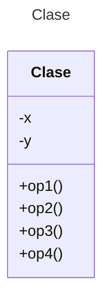

# Proyecto - Java POS - Maven

Proyecto de mini Punto de Venta (POS) en Java con Maven.

## Diagrama de clases
[Editor en línea](https://mermaid.live/)

[Referencia-Mermaid](https://mermaid.js.org/syntax/classDiagram.html)

## Diagrama de clases UML con draw.io
El repositorio está configurado para crear Diagramas de clases UML con ```draw.io```. Para usarlo das doble clic sobre el archivo ```uml.class.drawio.png```. Asegúrate de agregar las formas UML en el menú de formas del lado izquierdo (opción ```+Más formas```).

### Prompts para generar los Diagramas de Clase y Secuenca con MermAId

Para mejores resultados agrega primero como contexto las clases del proyecto y después aplica los prompts.

```
@mermaid /uml
@mermaid /sequence
```

## Uso del proyecto con Maven

### Compilar
```
mvn compile
```
### Probar N tests
```
mvn test
```
### Probar 1 test
```
mvn test -Dtest="AppTest#testPOS" 
```
### Ejecutar App
```
mvn -q exec:java
```
```
java -cp target/classes miPrincipal.App
```
### Empacar App
```
mvn package
```
### Limpiar binarios
```
mvn clean
```
